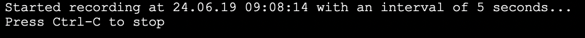
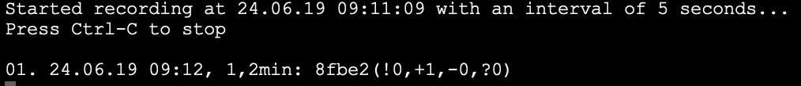
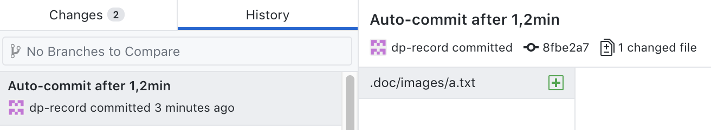

# Setup
#### 1. Get .NET Core
In order to use the DProg tooling you need to have the .NET Core framework installed. You can [download it for free from Microsoft](https://dotnet.microsoft.com/download) for your operating system.

#### 2. Get this repository
Fork this repository and clone it to your computer. (If you just clone it, you'll not be able to retain any changes by pushing them.)

Alternatively download the ZIP file of the repository and extract it to a DProg root directory in some Git repository of your own.

#### 3. Check the tools
Open a console/shell window on the directory where the `dp-record.*` files are located in your repository.

Run the `dp-record` script for your operating system like this:

* Windows: `dp-record.bat 5`
* Linux/macOS: `./dp-record.sh 5`

You should see a message like this:

Now create a text file (e.g. `a.txt`) in the repository and watch what happens in the console/shell window:

Your change to the repo automatically got committed. Check the commit log with the tool of your choice:

Press `Ctrl-C` to stop the automatic recording.

If you got this far without any errors you're set for your first Deliberate Programming session.

#### 4. Install a visual Git client (optional)
Install a visual Git client. It makes it easier to later go through the automatic commits created during a DProg session. The [GitHub Desktop Client](https://desktop.github.com/) would be a free and simple choice.

#### 5. Install a screen capturing tool (optional)
You may also want to install a tool for taking periodic screenshots. This helps if you should be working in non-text files or draw diagrams visible only on screen (eg. by using an online whiteboard app). [Screenbar](https://apps.apple.com/us/app/screenbar/id1329392611?ls=1) can help you on macOS, or see [here](https://www.guidingtech.com/56099/automatically-take-screenshots-windows-pc/) for an option on Windows.

[ImageMagick](https://imagemagick.org/) also is a free cross-platform choice whose `import` tool should do the trick.
