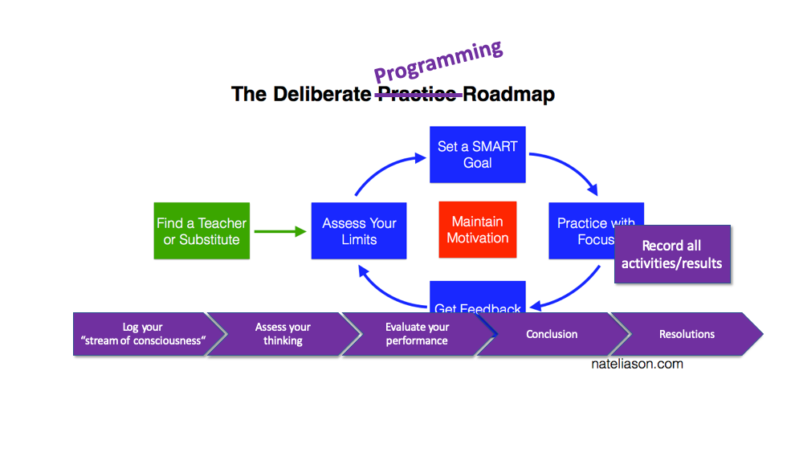
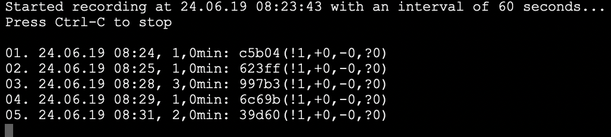

# Deliberate Programming Training Room

If you want to try out Deliberate Programming (DProg) for yourself this is your starting point.

Deliberate Programming is about systematically getting better at, well, programming. It's based on Deliberate Practice (DPrac) as described by K. Anders Ericsson for example in [The Role of Deliberate Practice in the Acquisition of Expert Performance](https://graphics8.nytimes.com/images/blogs/freakonomics/pdf/DeliberatePractice%28PsychologicalReview%29.pdf). Or for a less scientific introduction to DPrac see the articles [here](https://medium.com/the-crossover-cast/deliberate-practice-learn-like-an-expert-cc3114b8a10e) and [here](https://medium.com/the-crossover-cast/get-better-at-anything-6-steps-of-deliberate-practice-19830bfc9460).

**What DProg is adding to DPrac is a method to work in a focused way on a certain area of improvement and reflect on the experience. For that purpose DProg is employing some tools for automatic observation of one's progress while working on a task.**

* Git serves as the "flight recorder" logging all thoughts materializing in files.
* A small tool called `dp-record` is used to trigger Git to record recent file changes.
* Optionally a tool to take periodic screenshots and add them as files to the Git repo.

See the [setup documentation for details](.doc/setup.md)

## Deliberate Programming
Deliberate Practice [boils down to](https://medium.com/the-crossover-cast/get-better-at-anything-6-steps-of-deliberate-practice-19830bfc9460):

1. Set specific, realistic goals
2. Break out of your comfort zone
3. Be consistent and persistent
4. Seek feedback

This can be done for any skill/discipline/practice there is: you can practice deliberately playing the violine, dancing, knitting, playing chess, cooking, scuba diving, remembering numbers - or programming.

But programming is special in so far as "seeking feedback" is easier because your practice easily leaves at lot of traces which then can be reflected on.

And Deliberate Programming is special in that it guides you through the practice period and a subsequent reflection. DProg can thus more easily be practiced even without a coach - although getting feedback from a more advanced programmer always is very valuable and should be sought.

### Choose your area of improvement
You start DProg by choosing an area of programming you want to improve in. That can be the application of a tool, familiarity with a framework, Clean Code principles, or a method like TDD.

### Determine meaningful metrics
For the chosen area of improvement think of how you'd assess your knowledge, your abilities. What does it take to excell in that area? How could you possibly measure progress?

Example TDD:

What makes a developer good at applying TDD to a programming problem? Here are some suggestions:

* TDD requires you to write test code before production code. It's a test-first approach.
* TDD requires test cases to progressively become more "difficult". It's an incremental approach to testing.
* TDD requires you to switch between writing test code and production code again and again. It's an iterative approach to testing.
* TDD requires you to refactor after you got a test to pass. Remember the TDD rhythm: red-green-**refactor**.
* TDD requires tests that got to green to stay green.
* TDD requires you to write the most simple production code to get the test to pass. Remember the KISS principle. But what is simple? It means at least two things:
  1. Future tests don't accidentally are green right away because of excess functionality implemented for an earlier test.
  2. All alternative cases in production code are covered by tests written so far.

When reflecting on a TDD task you sure can assess whether you acted more or less true to the above principles/rules. The more you observed them without hesitation, the better you are/have become.

So much for general DPrag. Now for specific DProg.

### Run a Deliberate Programming session
To actually become better at something, you have to act. Work through exercises so it's safe to fail. Apply your knowledge and skills at best - and then ruthlessly assess your performance. This is where the DProg tools and process come in.

#### Choose a task
Choose a task to accomplish "under observation" by the DProg tools. You can clone this repo for each task or you can collect several tasks and multiple sessions in a single clone. Go through the above Setup steps at least once, though.

Example TDD:

If you want to improve your TDD skills you could start with a simple code kata like [From Roman Numerals](https://ccd-school.de/en/coding-dojo/function-katas/from-roman-numerals/).

Choose a task and then right away start working on it "under observation". The more time is logged by the DProg tools, the more material there is to reflect and improve on.

#### Work on your task
To start a DProg session do the following:

1. Set a timer for how long you want to focus. Experiment with different durations, start with 30 minutes.
2. Open a console/shell window in the root of a clone of this repo.
3. Start `dp-record` to log whatever you're doing in the repo with automatic commits.

* Windows: `dp-record.bat`
* Linux/macOS: `./dp-record.sh`

In case you expect to do work with tools not leading to files stored in the repo, also start the automatic screen capture tool of your choice. Let it store the screen snapshots in some sub-folder in the repo so they get auto-committed, too.

If you like, you can commit manually, too, at any time. By that you can insert more information into the commit stream. Maybe after 10 auto-commits you get to a "milestone" and want to document that explicitly. That's great help for you later reflection.

**Important**: **Be sure to save your work on files belonging to your task often** (be that tests, production code, documentation, diagramms etc.). Maybe there is an auto-save feature in your IDE which stores changes automatically when switching tabs, or just press a keyboard shortcut whenever you stop typing (or at least at the end of every paragraph). **Make this a habit!** Only that way you'll get a fine grained recording of the progress you make.

Once the recording of any changes to your repo has been started work on your task for the set duration. For 30min of work you'll see at most 30 "anonymous" commits in your repo at the end; probably it will be less, though, because you won't be changing files constantly.

Here's an example of what you should see in the console/shell window happening:

Each line documents a commit made bei `dp-record` with a timestamp, the time elapsed since the previous commit (e.g. *3,1min*, if nothing changed for that long time), an abbreviation of the commit's hash (e.g. *c5b04*), and some stats on the changes committed: *(!\<number of files modified>,+\<number of files added>,-\<number of files deleted>, ?\<other changes>)*.

Sometimes changes get committed, sometimes there is nothing to commit, and so on...

If you should feel a bit uneasy or tense because you can't shed the thought of being watched (even though it's you watching yourself), that's normal. It will go away after a while when you get used to working this way. Try not to force anything. Don't make it a competition with yourself.

#### Reflect on your work
Once the time's up, stop the logging by pressing `Ctrl-C`. Maybe now's the time to take a little break before you start into the next phase of DProg. So far it has been easy. You were doing familiar stuff: programming.

When you're ready, you come back and go through several passes of reflection:

###### Pass 1: Comment - Write a thought log
Go through the commits of the task period, look at which files changed, look at how they changed and write down two things for each commit:

* What happened? Give the commit a short title or description
* What were your thoughts/feelings at that time in the process.

(Sometimes several commits can be bundled up in one log entry because they are very related.)

Using a visual Git tool makes it easier to scroll through the commits with their files. 

The number of files per commit should be small usually. How many can you change within 60 seconds? (Except if you had a lot of files generated.) Hence it should not be too difficult to follow the unfolding of your results. The increments per sampling period of the automatic log are small.

Alternatively push your repo to GitHub, for example, and use the online view of your commits. This even has the advantage of allowing you to link to commits in your log.

Make it an "impersonal" report. Just note obersavations about your thinking process/progress. This is not the time for judgement or musings. This is just a log of your thoughts which led to visible results.

You can use a simple .txt/.md file to write this log. But it has turned out that using a tool which lets you create a table will make the following steps easier.

* Use the first column for the commit hashes.
* Use the second column for your comments.

Writing this log should follow the SRP: don't do more than logging your thoughts. Avoid multitasking by switching between different mental levels. Try to be impartial.

At the end take a breath or two, even a short break.

###### Pass 2: Assess - How easily did your ideas flow?
Once you've commented your commits you looked more closely (maybe in conjunction with the commit log).

Now's the time for assessing your progress. Did your work move along as expected? Where did you struggle? Where did it flow? Look for the conflicts between your expectation and reality. Find any deviation and hesitation with regard to what you wanted to do and what you actually did.

* Why hesitation/deviation? Because they can be considered waste in the Lean sense. [Read more about the reasoning behind that in an article by Ralf Westphal.](https://ralfw.de/2016/08/lets-play-lean/)
* Why "flow"? Because being good at something, being fluent means that your ideas can flow. It's easy for your to manifest any idea about how increase a quality in your work piece. [Read more about the notion of idea flow in a book by Janelle Arty Starr.](https://leanpub.com/ideaflow)

Here also stay focused on just that. Don't get ahead of yourself or the method. First it was just logging raw thoughts. Now it's just logging conflicts/flow.

You might even indulge in a bit of root cause analysis (eg. use 5-whys).

Write your findings up in another .txt/.md document or expand your thought log.

At the end take a breath or two, even a short break.

###### Pass 3: Evaluate - How did you performance compared to the metrics chosen?
Once you've compile your assessment it's judgement time. Evaluate how your work unfolded. Go over your assessment (maybe in conjunction with the thought log).

Where did you do well, where did you falter or fail? Take into account the metrics you initially defined for the area of improvement in question. How did you with regard to them? Maybe you improved in some, maybe not.

What are your strengths, your weaknesses? Find patterns. Ask "What's may part in all of this?"

This is the level of insights - be they pleasant or unpleasant. This is where you generate feedback for yourself.

At the end take a breath or two, even a short break.

###### Pass 4: Conclude
Finally step back and put everything together. What's your conclusion from all that you've gathered in data and insights? What are your "lessons learned"?

Also you want to write down a resolution or two for what you want to do better next time. Which concrete measures will you take to improve on the metrics?

And if you like, do a little retrospective on the DProg process. How did that feel?

## Enjoy!
Systematically becoming better is no easy task. Going through all the DProg passes is no cakewalk. And it's not supposed to be one. Remember: DPrag is about breaking out of your comfort zone. That's pertaining to the area of improvement, but also it's pertaining to the process of practicing.

That said please keep in mind: improvement should be fun, too. Insight by itself, understanding yourself better should lead to relaxation due to the removal of illusion. And that is liberating, a source of joy. Try to keep that in mind if DProg should frustrate you once in a while.
